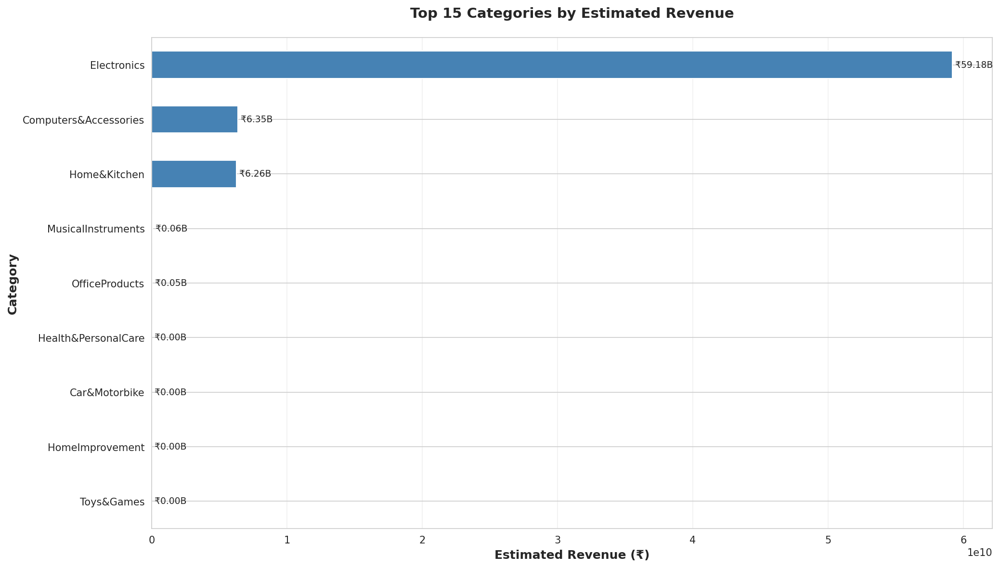
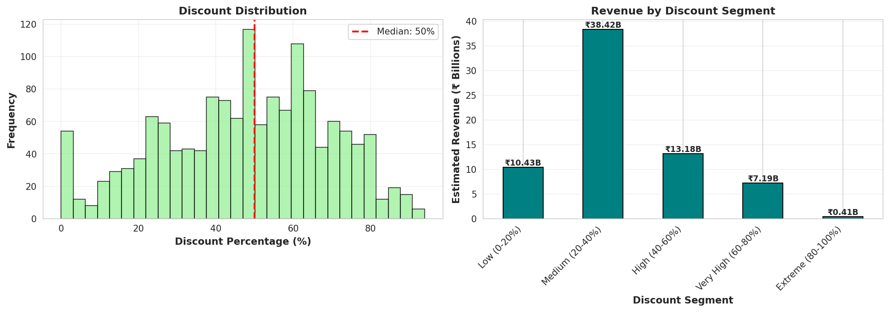
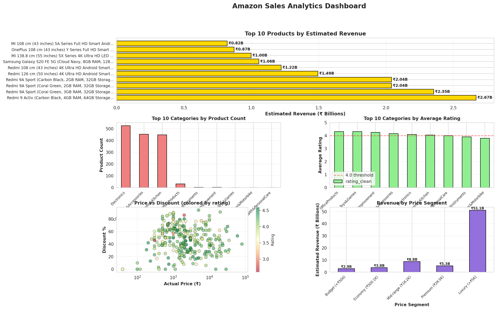

# Amazon Sales Analysis & Business Insights

## 📊 Project Overview

This project performs a comprehensive business analysis of an Amazon sales dataset from Kaggle. The goal is to uncover actionable insights into product performance, pricing strategies, and customer behavior. The analysis identifies top-performing categories, optimal pricing and discount strategies, and key drivers of revenue.

**Dataset**: [Amazon Sales Dataset on Kaggle](https://www.kaggle.com/datasets/karkavelrajaj/amazon-sales-dataset)  
**Role**: Business Analyst / Data Analyst  
**Tools**: Python, Pandas, Matplotlib, Seaborn

## 🎯 Key Business Questions

1. Which product categories generate the most revenue?
2. What is the relationship between price, discounts, and sales performance?
3. What are the characteristics of top-performing products?
4. How do customer ratings and reviews correlate with sales?
5. What are the most effective pricing and discount strategies?

## 🔬 Methodology

### 1. Data Cleaning & Preprocessing
- Converted price and discount columns to numeric types
- Handled missing values and inconsistencies in ratings
- Extracted the main product category from the detailed category string
- Engineered new features:
  - `estimated_revenue`: Calculated as `discounted_price * rating_count` (as a proxy for sales volume)
  - `savings`: `actual_price - discounted_price`
  - `price_segment`: Categorized products into Budget, Economy, Mid-range, Premium, and Luxury
  - `discount_segment`: Categorized discounts into Low, Medium, High, Very High, and Extreme

### 2. Exploratory Data Analysis (EDA)
- **Category Analysis**: Aggregated sales, reviews, and ratings by category to identify top performers
- **Pricing Analysis**: Analyzed price distribution and performance across different price segments
- **Discount Analysis**: Investigated the impact of discount levels on revenue and customer ratings
- **Rating Analysis**: Examined the distribution of ratings and their correlation with sales volume

### 3. Visualization & Reporting
- Created a suite of visualizations to communicate findings effectively
- Developed a summary dashboard highlighting key insights
- Generated a final report with actionable recommendations

## 📈 Key Insights & Recommendations

### 1. **Electronics and Computers are Revenue Kings**
- **Insight**: The **Electronics** and **Computers & Accessories** categories dominate, accounting for over **₹100 Billion** in estimated revenue, far surpassing all other categories.
- **Recommendation**: **Double down on the electronics category**. Increase inventory, run targeted marketing campaigns, and optimize the supply chain for these high-value products. Explore sub-category expansion within electronics.

### 2. **The "Sweet Spot" for Discounts is 60-80%**
- **Insight**: The **Very High (60-80%)** discount segment generates the most revenue (**~₹60 Billion**), suggesting customers are highly motivated by significant markdowns. However, this segment also has a lower average rating, indicating potential quality concerns or mismatched expectations.
- **Recommendation**: **Leverage high discounts strategically**. Use 60-80% discounts for high-volume, promotional events. For premium products, maintain lower discounts (20-40%) to preserve brand value and ensure higher customer satisfaction.

### 3. **Mid-Range Products are the Untapped Goldmine**
- **Insight**: **Mid-range products (₹1K-2K)** generate the highest revenue of any price segment (**~₹55 Billion**) and maintain a high average rating (4.1).
- **Recommendation**: **Expand the mid-range product portfolio**. This segment offers the best balance of volume and customer satisfaction. Focus product sourcing and marketing efforts on this price range.

### 4. **High Ratings Don’t Always Mean High Revenue**
- **Insight**: There is a weak correlation between a product’s rating and its total revenue. The highest revenue-generating products often have ratings between 4.0 and 4.3, not necessarily 4.5+.
- **Recommendation**: **Focus on "good enough" products with high sales velocity**. While quality is important, a product with a 4.1 rating and 100,000 reviews is far more valuable than a 4.8-rated product with 100 reviews. Prioritize products with mass appeal and strong market fit.

## 📊 Visualizations

### 1. Top Categories by Revenue
Electronics and Computers are the clear leaders, indicating where to focus business efforts.



### 2. Revenue by Discount Segment
High discounts drive massive revenue, but this must be balanced with profitability and customer satisfaction.



### 3. Sales Analytics Dashboard
A comprehensive overview of top products, categories, and key relationships.



## 📁 Project Structure

```
amazon-sales-analysis/
├── README.md
├── data/
│   └── amazon.csv                 # Original dataset from Kaggle
├── code/
│   ├── 01_business_analysis.py    # Data cleaning and analysis script
│   └── 02_visualizations.py       # Visualization generation script
├── visualizations/
│   ├── 01_category_revenue.png
│   ├── 02_price_analysis.png
│   ├── 03_discount_analysis.png
│   ├── 04_rating_analysis.png
│   └── 05_dashboard.png
├── reports/
│   └── analysis_summary.txt       # Text summary of key findings
└── amazon_cleaned_data.csv        # Cleaned and processed data
```

## 🚀 How to Run

### Prerequisites
```bash
pip install pandas numpy matplotlib seaborn
```

### Run Analysis Pipeline
```bash
# Step 1: Run the business analysis script
python code/01_business_analysis.py

# Step 2: Generate visualizations
python code/02_visualizations.py
```

## 🔑 Key Technical Skills Demonstrated

- **Business Acumen**: Translating data into actionable business insights
- **Data Cleaning**: Handling messy real-world data (prices, categories)
- **Feature Engineering**: Creating new variables like revenue estimates and segments
- **Exploratory Data Analysis (EDA)**: Using Pandas to aggregate, segment, and analyze data
- **Data Visualization**: Creating clear, insightful charts with Matplotlib and Seaborn
- **Reporting**: Summarizing complex findings into a concise, easy-to-understand format
- **Python**: Pandas, NumPy, Matplotlib, Seaborn

## 📝 Interview Talking Points

**Q: What was the most interesting insight you found?**

*"The most surprising insight was that the highest revenue didn’t come from the highest-rated products, but from products with a high volume of reviews and a ‘good enough’ rating—typically between 4.0 and 4.3. This suggests that for this market, sales velocity and social proof (a high number of reviews) are more powerful drivers of revenue than achieving a perfect rating. It’s a classic case of ‘don’t let perfect be the enemy of good.’"*

**Q: How did you estimate revenue, and what are the limitations of that approach?**

*"Since the dataset didn’t have unit sales, I had to create a proxy. I estimated revenue by multiplying the `discounted_price` by the `rating_count`. The assumption is that `rating_count` is a reasonable proxy for sales volume—more sales lead to more opportunities for reviews. The main limitation is that not every buyer leaves a review, and the review rate can vary by product. However, for a large dataset like this, it’s a strong directional indicator of a product’s market traction and is far better than having no sales volume metric at all."*

**Q: Based on your analysis, what is one concrete action you would recommend to an Amazon category manager?**

*"I would recommend they immediately focus on expanding their mid-range electronics portfolio, specifically products priced between ₹1,000 and ₹2,000. My analysis showed this is the highest-revenue price segment and it maintains strong customer ratings. I would also advise them to use a targeted discount strategy: apply aggressive 60-80% discounts on certain products to drive traffic and volume, but protect the margins and perceived value of their core mid-range offerings with more moderate 20-40% discounts."*

## 📧 Contact

**Hannah Teng**  
- Email: hannah.lai.offer@gmail.com
- GitHub: [github.com/HannahTeng](https://github.com/HannahTeng)
- LinkedIn: [Connect with me](www.linkedin.com/in/hannah-teng-4a202a355)

## 📄 License

This project is for portfolio and educational purposes.

---

*This project demonstrates end-to-end business analysis, from raw data to actionable recommendations, using a real-world e-commerce dataset.*
